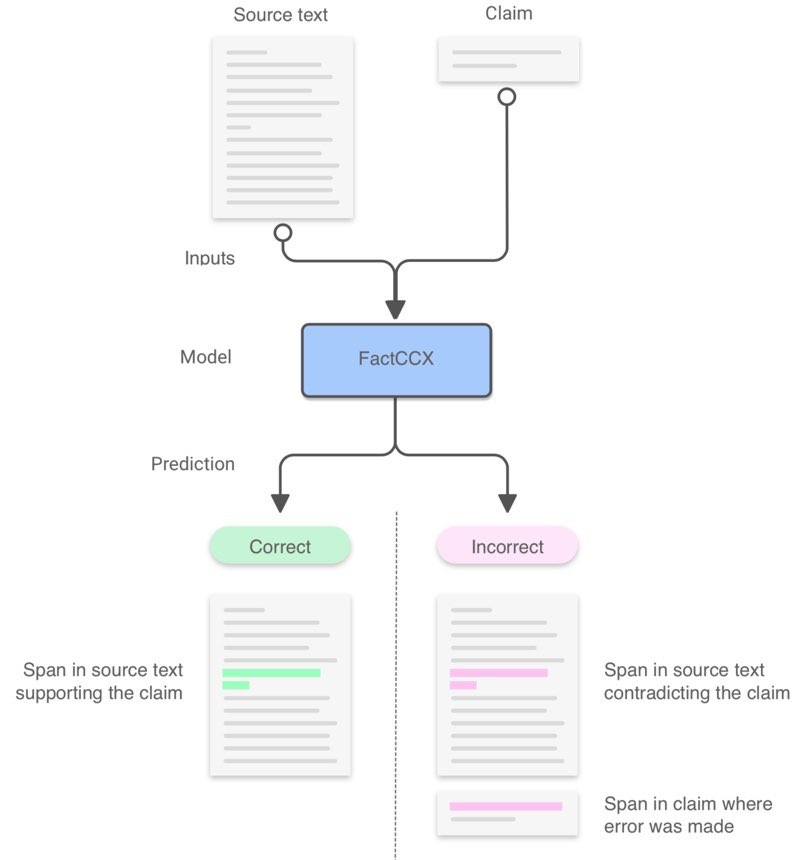

# fAutoFact:  Automated tool for evaluating the factual consistency of summarized text

Project for the AI Fellowship at Insight

In this project I introduce AutoFact which is an automated tool for evaluating the factual consistency of summarizad text. 

This project is built based on this paper from Salesforce Research: https://arxiv.org/abs/1910.12840 

=====================================================
## Project description

AutoFact: a tool that evaluates the factual consistency between the summary of a large text document and its source using Transformer models.

Development: used HuggingFace to built the AutoFact model using various Transformer model and compare various Transormer models such as Google BERT, Facebook RoBERTa and DistilBert to demonsterate runtime-accuracy trade off.

Demo: Served via an interactive command line interface created with the Python package Click.

===================================================

=====================================================
## Data description
The source text is CNN and Daily Mail news. The claim is first 

The data is provided from Salesforce research, and you can re-create the dataset here: https://github.com/salesforce/factCC/tree/master/data_generation

====================================================

To be updated: 

Once you installed the packages in requirements.txt or recreate the conda enviroment, you can run the XXX.sh script to test my saved models on some test cases. Instructions and the script will be provided soon. 
